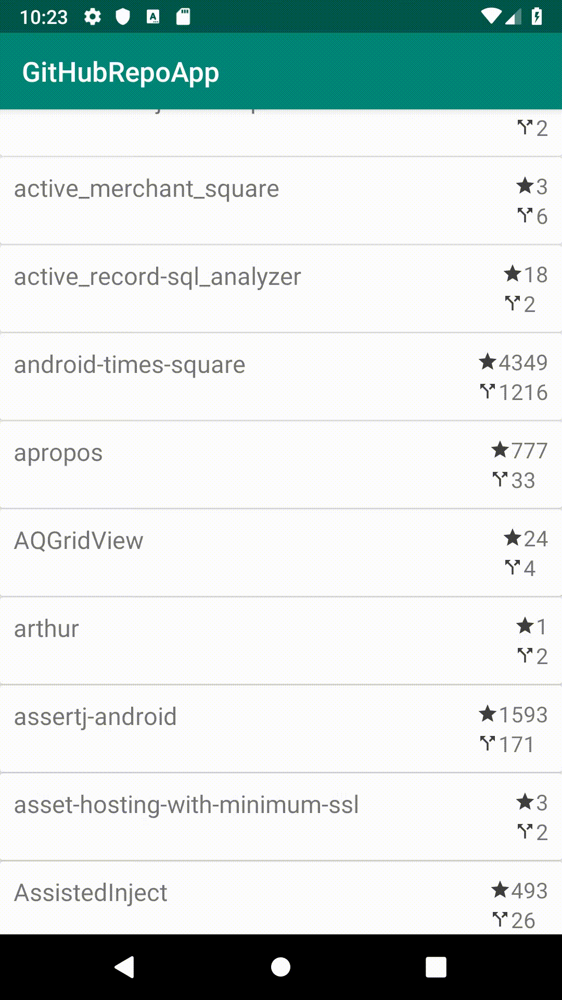
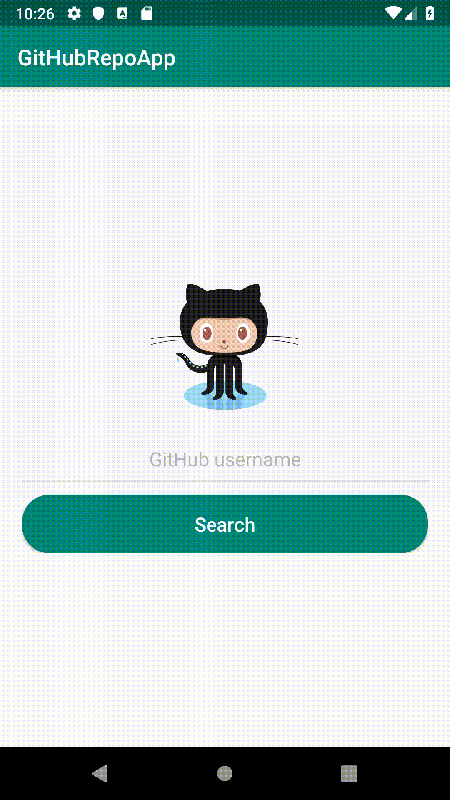

# GitHubRepos-App
It's a Github client android app based on Model-View-Presenter and Model-View-ViewModel(Presenter) architecture which connects to public Github REST API (https://api.github.com/).  
Project also contains unit (JUnit4) and UI (Espresso) tests.   
Used in this project: 
* [Dagger 2](https://github.com/google/dagger), 
* [RxJava 2](https://github.com/ReactiveX/RxJava),
* [Retrofit](https://github.com/square/retrofit),
* [Okhttp](https://github.com/square/okhttp), 
* [Moshi](https://github.com/square/moshi), 
* [ButterKnife](https://github.com/JakeWharton/butterknife),
* [MaterialEditText](https://github.com/rengwuxian/MaterialEditText),
* [Espresso](https://developer.android.com/training/testing/espresso),
* [Mockito](https://site.mockito.org/), 
* [JUnit4](https://github.com/junit-team/junit4),
* and some others ...

## Demo Overview (gifs)

  <table align="center">
  <tr>
    <th>repositories</th>
    <th>details</th>
  </tr>
  <tr>
    <th></th>
    <th></th>
  </tr>
  <tr>
    <th>not found</th>
    <th>empty username</th>
  </tr>
  <tr>
    <th></th>
    <th></th>
  </tr>
  </table>

